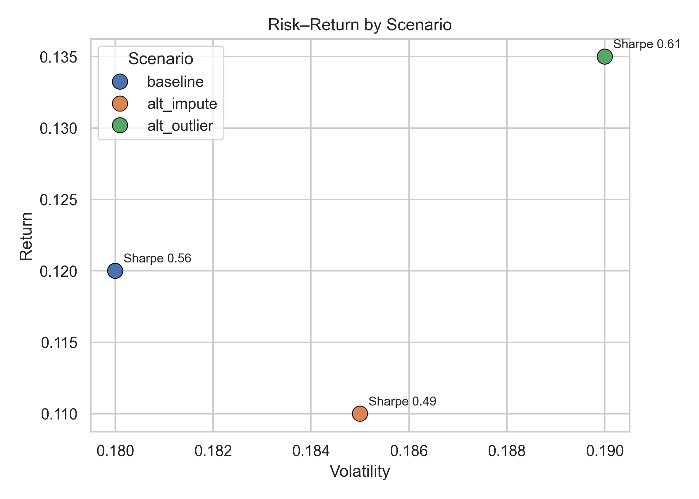
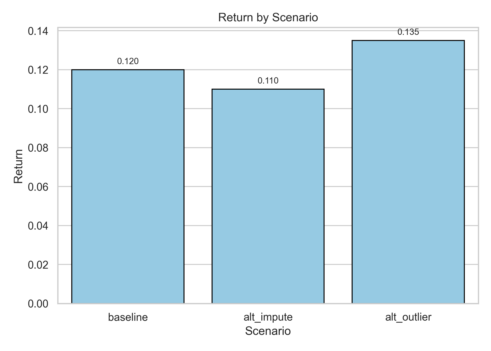
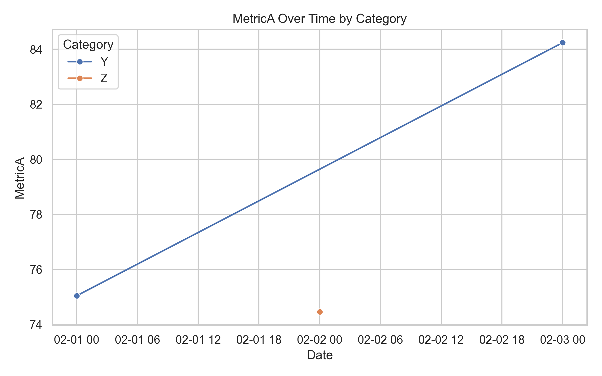
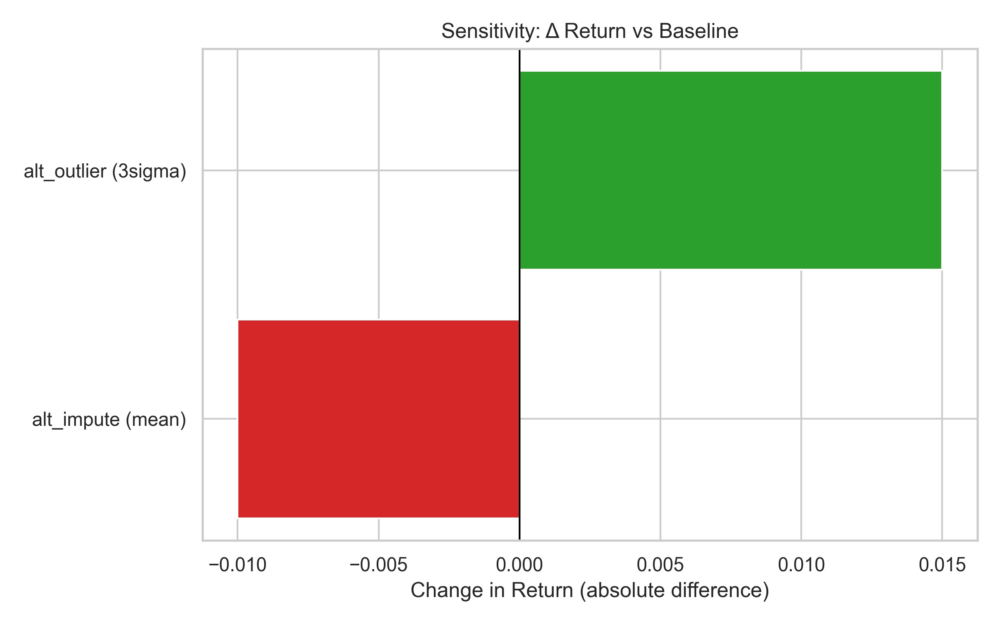

# Final Report — Earnings Signal (Stage 12)

## Executive Summary
- The **alt_outlier** scenario (3σ rule) yields the highest return relative to baseline (Δ ≈ +0.015).
- Risk (volatility) increases modestly under alt scenarios; **risk–return trade-off** remains favorable for alt_outlier.
- Conclusions are **sensitive to assumption choice**, but differences are **visible and explainable**.

## Key Visualizations
1. **Risk–Return by Scenario**  
     
   *Insight:* alt_outlier shifts upward on return with a slight move right on volatility.

2. **Return by Scenario**  
     
   *Insight:* alt_outlier > baseline > alt_impute.

3. **MetricA Over Time by Category**  
     
   *Insight:* Category differences persist; potential basis for segmentation.

4. **Sensitivity — Tornado Chart (Δ Return)**  
     
   *Insight:* Outlier handling has larger impact on return than imputation choice in this sample.

## Sensitivity Analysis
See table: `deliverables/tables/sensitivity_vs_baseline.csv`  
- **Largest positive** Δ Return: alt_outlier  
- **Imputation choice** (mean vs median) shows smaller effect.

## Assumptions & Risks (plain language)
- **Missing data:** We assume missingness is random; if not, imputation may bias results.
- **Outlier treatment:** Returns are heavy-tailed; stricter rules (3σ) can remove informative extremes.
- **Stability:** Market regimes can change; past risk–return may not generalize without monitoring.

## Decision Implications — “What this means for you”
- Prefer **alt_outlier** configuration when prioritizing return, with awareness of slightly higher volatility.
- If the audience is risk-averse or periods are calm, **baseline** may be safer.
- Monitor drift; revisit assumptions if missing rate or tail behavior changes materially.

---
*Generated on demand. Images saved under `deliverables/images/` and tables under `deliverables/tables/`.*
